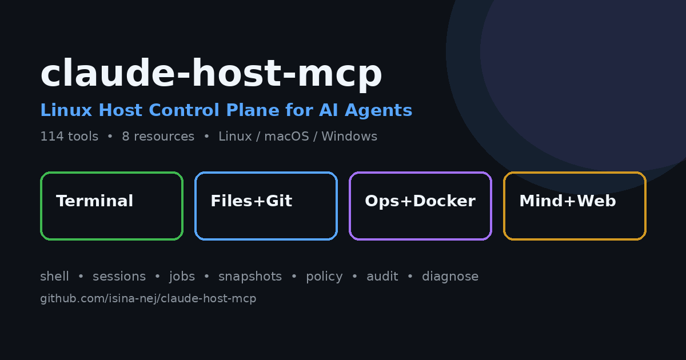
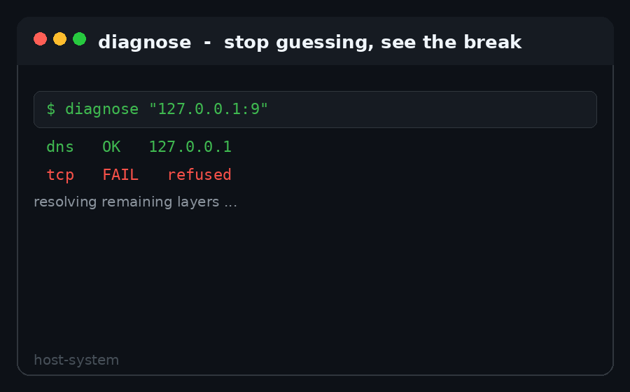
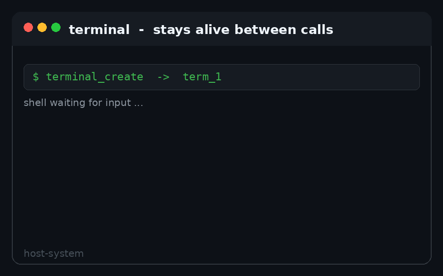
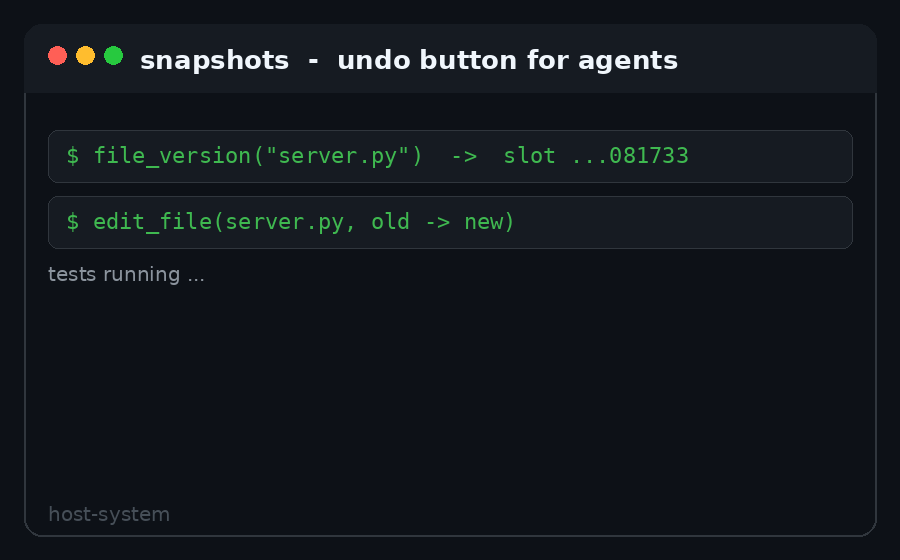
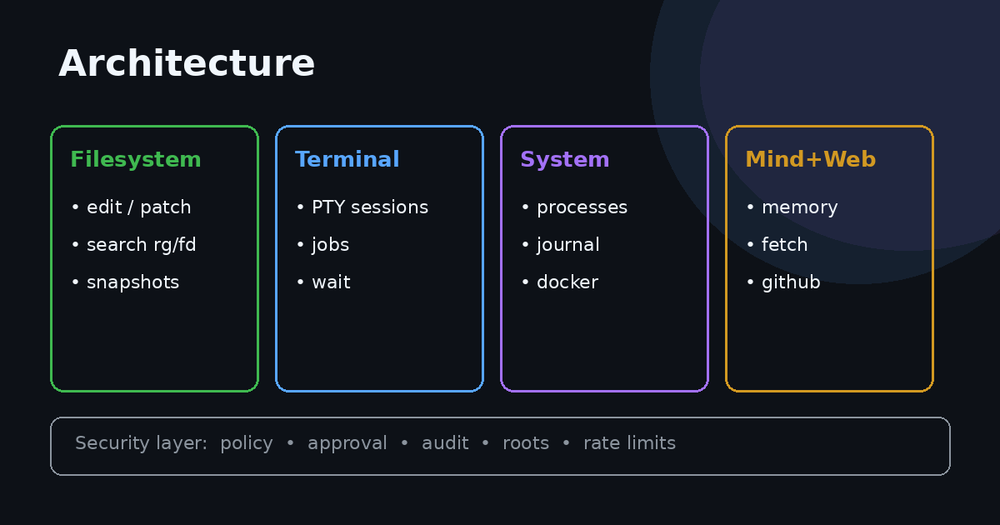
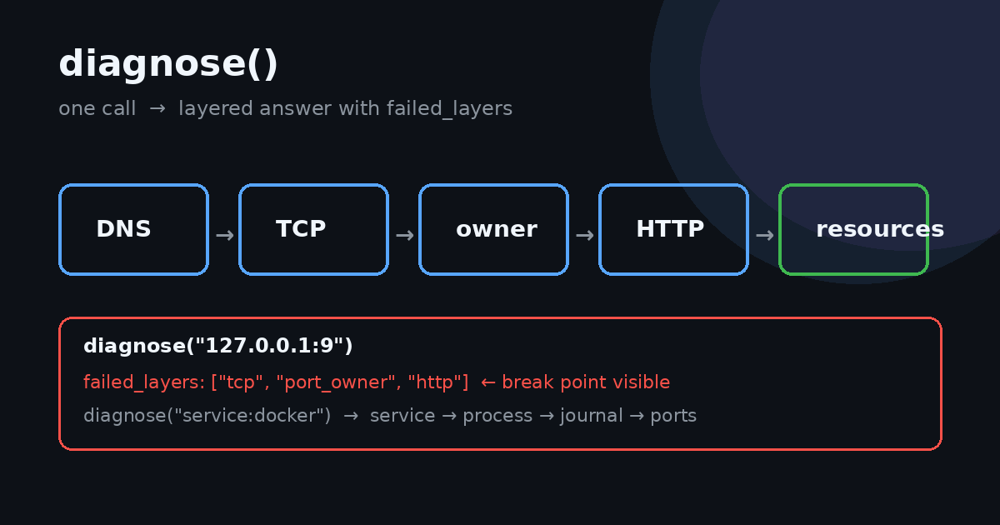
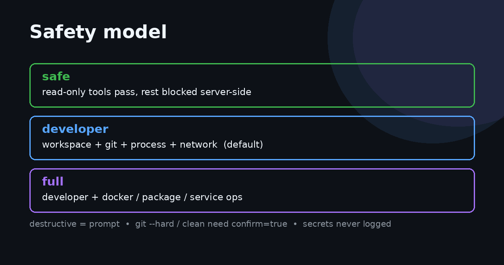

# claude-host-mcp

    

> سرور MCP محلی که به Claude Desktop دسترسی کنترل‌شده به ماشین میزبان واقعی می‌دهد — نه فقط محیط ایزوله (VM/سشن) خودش.



ساخته‌شده با MCP Python SDK نسخه **v2** (`MCPServer`) و انتقال stdio. با کاربر عادی اجرا می‌شود. روی **لینوکس، مک و ویندوز** کار می‌کند — ابزارها بر اساس سیستم‌عامل تطبیق داده می‌شوند (Bash/PowerShell، ps/tasklist، systemd/launchd/sc).

**یک سرور، کل میزبان:** ترمینال ماندگار · جاب پس‌زمینه · فایل+جست‌وجو · گیت+ورک‌تری · مانیتورینگ · داکر · گیت‌هاب/دیتابیس/اسلک · اسنپشات · حسابرسی · 9router محلی.

[English](README.md) | فارسی

## 🚀 نصب — سیستم‌عاملت رو انتخاب کن (۶۰ ثانیه)

> **یک کدبیس، سه سیستم‌عامل.** همین ۱۳۰ ابزار روی لینوکس، مک و ویندوز — کد خودش را با `platform.system` تطبیق می‌دهد.

```bash
git clone https://github.com/isina-nej/claude-host-mcp.git
cd claude-host-mcp
chmod +x install.sh install-mac.sh doctor.sh uninstall.sh
./install.sh        # مک: ./install-mac.sh · ویندوز: .\install.ps1
```

بعد **Claude Desktop را کامل ببندید و باز کنید**، یک سشن جدید بسازید و بگویید:

```text
Use the host-system MCP tool host_identity.
```

نام میزبان واقعی + کاربر شما در جواب = وصل به میزبان. قدم بعدی:

```text
system_snapshot  →  یک‌جا: cpu و حافظه و دیسک و load و دما و باتری و GPU و شبکه
diagnose "127.0.0.1:3000"  →  مسیر DNS به TCP به مالک به HTTP با failed_layers
memory_store("my-project", "Next.js 15, pnpm, port 3000")  →  سشن بعد یادش می‌ماند
```

---


## 📸 ببین چطور کار می‌کند

| 🔍 `diagnose` نقطه خرابی را پیدا می‌کند | 🖥️ ترمینال‌ها زنده می‌مانند | ↩️ اسنپشات = بازگشت |
|---|---|
|  |  |  |
| یک دستور DNS → TCP → مالک → HTTP → منابع را اجرا می‌کند و می‌گوید کدام لایه خراب است. | سرورهای dev و REPL بین دستورها زنده می‌مانند. خواندن با cursor و `wait` به‌جای polling. | قبل از ویرایش پرریسک `file_version` و اگر تست خراب شد `file_restore`. |


## چرا این پروژه؟

تسک‌های Cowork/Code در Claude Desktop داخل سندباکس محدود اجرا می‌شوند. این سرور یک پل به بیرون است: Claude با **۱۳۰ ابزار تایپ‌شده و ۱۰ ریسورس (۵ ثابت و ۳ تمپلیت)** روی میزبان واقعی کار می‌کند — شل، ترمینال ماندگار، جاب پس‌زمینه، فایل، جست‌وجو، گیت، مانیتورینگ، ژورنال، پورت، داکر، پکیج، شبکه، اسنپشات، زمان، حافظه، تفکر، وب، مرورگر، گیت‌هاب، دیتابیس، نقشه، درایو، اسلک، gateway محلی 9router — همه با ریشه‌های محدود، موتور پالیسی، لاگ حسابرسی و گاردریل دستورهای خطرناک.

هدف طراحی: هر کاری که یک توسعه‌دهنده/ادمین لینوکس در ترمینال می‌کند، ایجنت هم بتواند بکند — معنایی، قابل مشاهده، قابل لغو، قابل حسابرسی و قابل برگشت.
## ابزارها

۱۳۰ ابزار در سیزده گروه (تأییدشده زنده با handshake استاندارد). فقط ابزارهای مخرب تأیید می‌خواهند (بخش [سیاست تأیید](#سیاست-تأیید)).



**راهنمای خواندن:** هسته = شل و فایل روزمره · ترمینال+جاب = کار طولانی بدون polling · فایل+گیت = ویرایش معنایی با برگشت · عملیات+داکر = اول مشاهده بعد اقدام · ذهن+وب+یکپارچه‌سازی = حافظه و دنیای بیرون، همه با کلید · ناین‌روتر = AI محلی (چت/fanout/عکس/جست‌وجو).

### هسته

| ابزار | توضیح |
|---|---|
| `host_identity` | نام میزبان، `os` (Linux/Darwin/Windows)، کرنل، معماری، کاربر، خانه، PID سرور. ابزار سلامت نصب. |
| `system_summary` | لینوکس: `hostname` و `uname` و `id` و `uptime` و `df` و `free`. مک: `df` و `vm_stat` و `sysctl hw.memsize`. ویندوز: `hostname` و `whoami` و `Get-ComputerInfo` و `Get-PSDrive`. |
| `run_command` | در لینوکس/مک Bash (با `/bin/bash -lc`) و در ویندوز PowerShell. ورودی‌ها: `command` و `cwd` و `timeout_seconds`. خروجی: `exit_code` و `stdout` و `stderr`. |
| `read_file` | خواندن فایل متنی داخل ریشه‌های مجاز خواندن. ورودی‌ها: `path` و `max_chars`. |
| `write_file` | نوشتن فایل متنی داخل ریشه‌های مجاز نوشتن. بدون `overwrite=true` روی فایل موجود نمی‌نویسد. |
| `list_directory` | لیست دایرکتوری با پیشوند `DIR` و `FILE` داخل ریشه‌های مجاز. ورودی‌ها: `path` و `max_entries`. |

### ترمینال ماندگار

به‌ازای هر سشن یک پروسس شل زنده که بین کال‌ها باقی می‌ماند. برای dev server و REPL و ssh — نه دستورهای یک‌باره.

| ابزار | توضیح |
|---|---|
| `terminal_create` | ساخت شل (یا اجرای `command` تعاملی). برمی‌گرداند: `session_id` و `pid` و `cwd`. |
| `terminal_read` | خروجی افزایشی از `cursor` به بعد. `cursor` جدید برمی‌گرداند. |
| `terminal_write` | فرستادن کلید/دستور به stdin سشن. |
| `terminal_resize` | ذخیره ابعاد (متادیتا؛ هنوز ioctl واقعی PTY نیست). |
| `terminal_signal` | `INT` و `TERM` و `KILL` (در یونیکس `HUP` هم). مخرب — تأیید می‌خواهد. |
| `terminal_wait` | بلاک تا regex در `pattern` دیده شود یا پروسس بمیرد یا timeout. جایگزین حلقه polling. |
| `terminal_close` | بستن سشن. مخرب — تأیید می‌خواهد. |
| `terminal_list` | سشن‌های زنده با pid و cwd و سن و حجم بافر. |

### جاب پس‌زمینه

| ابزار | توضیح |
|---|---|
| `job_start` | اجرای جدا. `timeout_seconds` اختیاری برای kill نگهبان. برمی‌گرداند: `job_id`. |
| `job_status` | وضعیت، pid، exit code، حجم بافرها. |
| `job_output` | خروجی افزایشی `stdout` و `stderr` از `cursor` به بعد. |
| `job_wait` | بلاک تا پایان یا timeout. بهتر از polling. |
| `job_cancel` | اول `TERM` بعد ۵ ثانیه `KILL`. مخرب — تأیید می‌خواهد. |
| `job_list` | همه جاب‌ها، یا فقط در حال اجرا با `running_only=true`. |

### فایل‌ها

| ابزار | توضیح |
|---|---|
| `file_stat` | نوع، حجم (`size_bytes`)، زمان تغییر، سطح دسترسی. |
| `file_search` | جست‌وجوی بازگشتی نام فایل (`*.log`). خطاهای دسترسی نادیده گرفته می‌شوند، نتیجه‌های موفق نگه داشته می‌شوند. |
| `file_grep` | جست‌وجوی بازگشتی داخل متن با regex. اول `rg`، بعد `grep` در یونیکس، در ویندوز جایگزین داخلی پایتون. خروجی به‌صورت `file:line`. |
| `file_copy` | کپی فایل یا دایرکتوری. مبدأ باید خواندنی، مقصد باید نوشتنی باشد. |
| `file_move` | جابه‌جایی یا تغییرنام. هر دو سر باید نوشتنی باشند. مخرب — تأیید می‌خواهد. |
| `file_delete` | حذف فایل، یا دایرکتوری با `recursive=true`. هرگز خود ریشه پیکربندی‌شده را حذف نمی‌کند. مخرب — تأیید می‌خواهد. |
| `edit_file` | جایگزینی رشته دقیق (`old` به `new`). با `dry_run=true` پیش‌نمایش diff. اگر چند تطابق مبهم باشد بدون `replace_all=true` رد می‌کند. |
| `apply_patch` | اعمال unified diff (اول باینری `patch`، اگر نبود fallback ساده). `dry_run` دارد. |
| `head_file` | N خط اول فایل. |
| `tail_file` | N خط آخر فایل. |
| `directory_tree` | درخت ASCII با `depth` و `max_entries`؛ دایرکتوری‌های نویز (`__pycache__` و `.git` و `.venv` و `node_modules`) مخفی. |
| `find_files_tool` | جست‌وجوی glob؛ اول `fd`، اگر نبود `find` یا pathlib. |
| `search_text_tool` | جست‌وجوی متنی (پیش‌فرض literal، با `regex=true` الگو). اول `rg`. |
| `fuzzy_find_tool` | جست‌وجوی subsequence در نام فایل با رتبه‌بندی، بدون وابستگی. |

### پروسس و سیستم

| ابزار | توضیح |
|---|---|
| `process_list` | در لینوکس/مک `ps` مرتب‌شده بر اساس CPU و در ویندوز `tasklist`. ورودی‌ها: زیررشته `filter` و `limit`. |
| `process_kill` | ارسال سیگنال به PID (در ویندوز بدون `HUP`). از PID شماره ۱ و خود سرور محافظت می‌کند. مخرب — تأیید می‌خواهد. |
| `service_status` | وضعیت سرویس کاربر: در لینوکس systemd سطح کاربر، در مک فیلتر `launchctl list`، در ویندوز `sc query`. |
| `disk_usage` | در لینوکس/مک `df -h` و در ویندوز حجم درایو؛ اگر `path` بدهید اندازه همان مسیر مجاز هم اضافه می‌شود. |
| `system_snapshot` | وضعیت یک‌جای cpu و حافظه و دیسک و load و دما و باتری و GPU و شبکه و uptime به‌صورت JSON. |
| `journal_query` | دم ژورنال کاربر با فیلتر `service` و `priority` و `since` (در مک `log show`). |

### گیت

| ابزار | توضیح |
|---|---|
| `git_status` | شاخه جاری به‌علاوه `status --short --branch`. |
| `git_log` | کامیت‌های اخیر با فرمت کوتاه تاریخ. ورودی: `count`. |
| `git_diff` | تغییرات ثبت‌نشده به‌علاوه `--stat`. با `staged=true` نسخه `--cached` را نشان می‌دهد. |
| `git_branch` | شاخه‌های محلی و ریموت (`branch -a -v`). |
| `git_commit` | اجرای `add -A` و `commit -m`. پیام خالی یا درخت تمیز را رد می‌کند. هرگز push نمی‌کند. مخرب — تأیید می‌خواهد. |
| `git_show` | نمایش کامیت با stat. فقط خواندنی. |
| `git_blame` | blame بازه خطوط یک فایل tracked. فقط خواندنی. |
| `git_tag` | `list` (خواندنی) و `create` و `delete`. |
| `git_stash` | `list` و `push` و `pop` و `drop`. موردهای pop و drop مخرب‌اند. |
| `git_checkout` | سوییچ شاخه (یا ساخت با `-b`). روی درخت کثیف رد می‌کند. |
| `git_reset` | حالت‌های `--soft` و `--mixed` و `--hard`؛ مورد `--hard` نیازمند `confirm=true`. |
| `git_revert` | ساخت کامیت معکوس یک revision. |
| `git_merge` | مرج شاخه؛ در صورت تعارض خروجی تعارض را می‌دهد. |
| `git_rebase` | ریبیس روی upstream؛ `abort` و `cont` برای تعارض‌ها. |
| `git_clean` | پیش‌فرض `dry_run=true` فقط پیش‌نمایش؛ اجرا نیازمند `confirm=true`. |
| `git_worktree_create` | ورک‌تری ایزوله زیر `.worktrees/` برای کار ایجنت. |
| `git_worktree_list` | لیست ورک‌تری‌ها. فقط خواندنی. |
| `git_worktree_remove` | حذف ورک‌تری ایجنت. |

### شبکه

| ابزار | توضیح |
|---|---|
| `http_fetch` | گرفتن `http(s)` با سقف حجم. برمی‌گرداند: `status` و `content_type` و `truncated` و `body`. |
| `network_check` | تست دسترسی TCP به‌علاوه `latency_ms`. ورودی‌ها: `host` و `port` و `timeout_seconds`. |
| `download_file` | دانلود `http(s)` داخل ریشه نوشتنی با سقف بایت. در صورت رد شدن از سقف، فایل ناقص را پاک می‌کند. |
| `dns_lookup` | تبدیل hostname به آدرس‌ها. |
| `interface_list` | اینترفیس‌ها با وضعیت و MAC. |
| `connection_list` | سوکت‌های فعال با `ss` یا `netstat`. |
| `port_list` | سوکت‌های listening با مالک (در لینوکس `/proc`، اگر نبود `ss` یا `lsof`). |
| `port_check` | اتصال TCP به `host:port` با latency. |
| `port_owner` | مالک یک پورت listening: pid و comm و cmdline و cwd. |
| `diagnose` | عیب‌یابی لایه‌ای: برای `host:port` یا `http(s)://` مسیر DNS به TCP به مالک به HTTP به منابع؛ برای `service:NAME` مسیر سرویس به پروسس به ژورنال به پورت‌ها. خروجی `failed_layers`. |



### داکر

نیازمند CLI داکر. تغییرها محدود به پروفایل developer/full هستند و تأیید می‌خواهند.

| ابزار | توضیح |
|---|---|
| `docker_ps` | کانتینرها (پیش‌فرض در حال اجرا، با `all=true` همه). |
| `docker_logs` | دم لاگ کانتینر. |
| `docker_inspect` | وضعیت، ایمیج، پورت‌ها، مانت‌ها. |
| `docker_start` و `docker_stop` و `docker_restart` و `docker_rm` | چرخه حیات (timeout توقف ۱۰ ثانیه). |
| `docker_exec` | اجرای `sh -c` داخل کانتینر. `--privileged` بلاک است. |

### پکیج‌ها

مدیر بومی خودکار تشخیص داده می‌شود (apt/dnf/pacman/zypper/apk/brew/flatpak/snap). جست‌وجو و info همه‌جا؛ تغییر روی apt/dnf/pacman/brew و فقط پروفایل developer/full.

| ابزار | توضیح |
|---|---|
| `package_search` | جست‌وجوی پکیج. |
| `package_info` | متادیتای پکیج. |
| `package_install` و `package_remove` | نصب/حذف. تأیید می‌خواهد. |
| `package_update` | رفرش ایندکس. تأیید می‌خواهد. |

### ذهن: زمان، حافظه، تفکر

بدون وابستگی جدید. معادل رسمی time و memory و sequential-thinking با ابزارهای استاندارد.

| ابزار | توضیح |
|---|---|
| `time_now` | زمان جاری در timezone از نوع IANA (پیش‌فرض local). |
| `time_convert` | تبدیل datetime از نوع ISO بین timezoneها. |
| `time_zones` | لیست zoneهای IANA با فیلتر اختیاری. |
| `memory_store` | ذخیره یک observation روی entity (گراف دانش ماندگار). |
| `memory_link` | رابطه تایپ‌دار بین دو entity. |
| `memory_recall` | یادآوری substring روی entityها و observationها و رابطه‌ها. |
| `memory_forget` | حذف observation یا کل entity. مخرب — تأیید می‌خواهد. |
| `think` | ثبت یک گام استدلال در زنجیره. |
| `think_list` | برگرداندن زنجیره تفکر. فقط خواندنی. |
| `think_clear` | پاک کردن زنجیره. مخرب — تأیید می‌خواهد. |

### داده وب: fetch و جست‌وجو و مرورگر

| ابزار | توضیح |
|---|---|
| `fetch_text` | گرفتن URL و تبدیل به متن آماده LLM (حذف boilerplate، حداکثر ۳ ریدایرکت). |
| `web_search` | جست‌وجوی keyless-first (ترکیب html و wiki و duck)؛ پارامتر `backend`؛ Brave با کلید. |
| `wiki_search` | جست‌وجوی اختصاصی ویکی‌پدیا. بدون کلید، معتبر، ساخت‌یافته. |
| `browser_fetch` | رندر JS با کروم محلی اگر نصب باشد، وگرنه fallback روی fetch_text. |
| `browser_shot` | اسکرین‌شات PNG در ریشه نوشتنی. opt-in؛ تأیید می‌خواهد. |

### یکپارچه‌سازی: گیت‌هاب، دیتابیس، نقشه، درایو، اسلک

همه با کلید فعال می‌شوند؛ بدون کلید خطای راهنما می‌دهند و هرگز کرش نمی‌کنند. secret هرگز در audit لاگ نمی‌شود.

| ابزار | توضیح |
|---|---|
| `github_repo` | متادیتای ریپو بدون کلید (۶۰ در ساعت)؛ توکن سهمیه را بالا می‌برد. |
| `github_issue` | لیست/گرفتن/ساخت issue. ساخت تأیید می‌خواهد. |
| `github_pr` | لیست/گرفتن/ساخت PR. ساخت تأیید می‌خواهد. |
| `db_query` | کوئری با اولویت خواندن؛ dsn خالی sqlite محلی را پیدا می‌کند. نوشتن نیازمند confirm. |
| `db_status` | بررسی keyless وضعیت DB: فایل‌های sqlite و دسترسی postgres و redis. |
| `db_tables` | لیست جدول‌های یک DSN. |
| `redis_get` | گرفتن کلید؛ پیش‌فرض لوکال؛ fallback روی docker:redis. |
| `maps_geocode` | ژئوکد مستقیم (گوگل با کلید، وگرنه nominatim). |
| `maps_directions` | مسیریابی (گوگل با کلید، وگرنه فاصله خط مستقیم). |
| `drive_list` | لیست ریموت `rclone`؛ اگر یک ریموت باشد خودکار انتخاب می‌کند. |
| `drive_get` | دانلود فایل ریموت در ریشه نوشتنی. تأیید می‌خواهد. |
| `slack_list` | لیست کانال‌ها (توکن؛ ارسال با webhook هم ممکن است). |
| `slack_send` | ارسال پیام. تأیید می‌خواهد. |

### ناین‌روتر: gateway محلی AI

ناین‌روتر شما (نسخه 0.5.69) روی `127.0.0.1:20128` می‌شود ۱۴ ابزار + ۲ ریسورس. احراز خودکار: اول `NINEROUTER_API_KEY`، وگرنه اولین کلید فعال از `~/.9router/db/data.sqlite`. بدون تنظیم جدید.

| ابزار | توضیح |
|---|---|
| `nine_status` | سلامت + نسخه. بدون کلید. فقط خواندنی. |
| `nine_models` | ۳۴۹ مدل قابل روت. فقط خواندنی. |
| `nine_combos` | ۲۶ باندل (`sina-pro` و `image` و `FastImg`...) با اعضا. فقط خواندنی. |
| `nine_providers` | ۳۷ اتصال، فقط سلامت، بدون secret. فقط خواندنی. |
| `nine_usage` | درخواست‌ها، توکن‌ها، هزینه. فقط خواندنی. |
| `nine_chat` | پرسش از هر combo/model. متن + usage. |
| `nine_chat_stream` | چت SSE، متن به‌هم‌چسبیده. |
| `nine_fanout` | یک پرامپت به N مدل موازی (حداکثر ۶). الگوی داور/ensemble. |
| `nine_image` | ساخت عکس (`b64_json`). انتخاب خودکار FastImg. تست‌شده زنده. |
| `nine_tts` | متن به گفتار. شکل پاسخ عبوری. |
| `nine_stt` | گفتار به متن از base64. |
| `nine_embeddings` | امبدینگ متن‌ها. شکل پاسخ عبوری. |
| `nine_search` | جست‌وجوی وب از طریق `searchapi` ناین‌روتر. بدون کلید برای شما. |
| `nine_video` | ساخت ویدیو. روی بیشتر میزبان‌ها speculative. |

ریسورس‌ها: `nine://status` و `nine://models`.

> الگوی چندایجنتی: `nine_fanout(["sina-economy","sina-pro"], prompt)` بعد مقایسه بعد `nine_chat` داور و تصمیم. سقف موازی ۶ برای حفظ سهمیه free-tier.

### اسنپشات و حسابرسی

| ابزار | توضیح |
|---|---|
| `snapshot_create` | کپی فایل/دایرکتوری در اسلات زمان‌دار قبل از عملیات پرریسک. |
| `snapshot_list` | اسلات‌ها با مبدأ و زمان ساخت. |
| `snapshot_restore` | برگرداندن اسلات. مخرب — تأیید می‌خواهد؛ روی تداخل نیازمند `overwrite`. |
| `file_version` | اسنپشات تک‌فراخوانی یک فایل قبل از ویرایش. |
| `file_restore` | برگرداندن جدیدترین اسلات ثبت‌شده برای یک مسیر. مخرب — تأیید می‌خواهد. |
| `audit_log` | آخرین رکوردهای حسابرسی (فقط مسیر و حجم، هرگز محتوا). |
| `audit_search` | فیلتر با زیررشته ابزار و ok درست/غلط. |

## ریسورس‌ها

کانتکست زنده بدون tool call:

| URI | محتوا |
|---|---|
| `system://summary` | هویت یک‌خطی، uptime، دیسک، حافظه. |
| `system://snapshot` | JSON کامل `system_snapshot`. |
| `system://ports` | جدول پورت‌های listening به‌صورت JSON. |
| `policy://current` | پروفایل، ریشه‌ها، سقف‌ها و مجموعه مخرب‌ها به‌صورت JSON. |
| `audit://recent` | ۲۰ رکورد آخر حسابرسی به‌صورت JSON. |
| `process://{pid}` | سطر ps به‌علاوه cmdline و cwd به‌صورت JSON. |
| `terminal://{session}` | دم بافر به‌علاوه وضعیت زنده‌بودن به‌صورت JSON. |
| `job://{job_id}` | وضعیت به‌علاوه دم stdout و stderr به‌صورت JSON. |

## سیاست تأیید

فقط ابزارهای مخرب تأیید می‌خواهند: `file_delete` و `file_move` و `terminal_close` و `terminal_signal` و `process_kill` و `job_cancel` و `git_commit` و `git_reset` و `git_revert` و `git_merge` و `git_rebase` و `git_checkout` و `git_clean` (اجرا) و `git_tag` (ساخت/حذف) و `git_stash` (pop/drop) و `git_worktree_*` (ساخت/حذف) و `snapshot_restore` و `file_restore` و تغییرهای `docker_*` و `package_*` و `memory_forget` و `think_clear` و ساخت `github_issue` و `github_pr` و نوشتن `db_query` و `browser_shot` و `drive_get` و `slack_send`. بقیه — شل، خواندن، جست‌وجو، مانیتورینگ، ژورنال، پورت، diagnose — بدون اصطکاک تأیید اجرا می‌شوند.

> نکته: حذف از طریق شل (`rm` یا `Remove-Item` داخل `run_command`) بلاک نیست و تأیید نمی‌خواهد. برای حذف محافظت‌شده از `file_delete` استفاده کنید.

## ایمنی در یک نگاه



سه پروفایل، یک قانون: **مخرب = تأیید**. حالت `safe` فقط ابزارهای خواندنی را رد می‌کند؛ `developer` (پیش‌فرض) فضای کاری و گیت و پروسس و شبکه را اضافه می‌کند؛ `full` عملیات سبک داکر/پکیج/سرویس را باز می‌کند. `reset --hard` و اجرای `clean` علاوه بر تأیید نیازمند `confirm=true` در خود کال هستند. secretها (توکن و DSN) هرگز در audit لاگ نمی‌شوند.

## امنیت

سرور با کاربر عادی شما اجرا می‌شود. هر چیزی که آن کاربر بتواند بخواند یا تغییر دهد از طریق این ابزارها قابل دسترس است.

بلاک‌های سخت در `run_command`: دسترسی `sudo` و `su` و `pkexec`، خاموش/ریستارت سیستم (در ویندوز `Restart-Computer` و `Stop-Computer`)، ابزارهای دیسک (`mkfs` و `wipefs` و `fdisk` و `parted` و `diskpart` و `Format-Volume` و `Clear-Disk`)، نوشتن خام `dd of=/dev/*`، حذف بازگشتی `/` یا `$HOME` (در ویندوز حذف ریشه درایو مثل `Remove-Item C:\`)، تغییر مالکیت سراسری روی `/`، fork bomb.

موتور پالیسی (`HOST_MCP_PROFILE`): `safe` یعنی فقط ابزارهای خواندنی رد می‌شوند و بقیه در سمت سرور بلاک‌اند؛ `developer` (پیش‌فرض) یعنی فضای کاری کامل به‌علاوه گیت و پروسس و شبکه؛ `full` یعنی developer به‌علاوه عملیات سبک داکر/پکیج/ریستارت سرویس. عملیات مخرب گیت (`reset --hard` و اجرای `clean`) علاوه بر تأیید کلاینت نیازمند `confirm=true` در خود کال هستند. `docker_exec --privileged` همیشه بلاک است. `process_kill` به PID شماره ۱ و خود سرور سیگنال نمی‌فرستد؛ `file_delete` ریشه‌های پیکربندی‌شده را حذف نمی‌کند؛ `git_commit` هرگز push نمی‌کند؛ `service_status` فقط سطح کاربر است؛ `download_file` و `http_fetch` فقط `http(s)` با سقف بایت هستند.

محدودیت نرخ (`HOST_MCP_RATE_LIMIT` با پیش‌فرض `60/60`): بودجه کال به‌ازای خانواده ابزار؛ کال اضافه با خطای rate-limit رد می‌شود نه اجرا.

حسابرسی (`~/.local/share/claude-host-mcp/audit.jsonl`، با `HOST_MCP_AUDIT_FILE` عوض می‌شود، با مقدار خالی خاموش): هر ابزار تغییردهنده timestamp و tool و hint آرگومان و ok را لاگ می‌کند. محتوای فایل هرگز لاگ نمی‌شود.

> بلاک‌لیست فقط گاردریل است، نه سندباکس. دسترسی شل ذاتاً قدرتمند است. ریشه‌های `*_ROOTS` را در حداقل لازم نگه دارید.

## نیازمندی‌ها

- لینوکس، مک یا ویندوز؛ پایتون 3.10+
- Claude Desktop با پشتیبانی MCP محلی
- `uv` اختیاری است؛ نصاب‌ها در صورت نبود به `venv` و pip برمی‌گردند

## پیکربندی

زیر `host-system` و کلید `env` در `claude_desktop_config.json` تنظیم می‌شود. بعد از تغییر، Claude Desktop را ریستارت کنید.

| متغیر | پیش‌فرض | توضیح |
|---|---|---|
| `HOST_MCP_PROFILE` | `developer` | `safe` (فقط خواندنی) و `developer` و `full`. |
| `HOST_MCP_READ_ROOTS` | `$HOME:/etc:/var/log` (لینوکس/مک) و `$HOME` (ویندوز) | ریشه‌های مجاز خواندن (جداکننده مسیر سیستم‌عامل). |
| `HOST_MCP_WRITE_ROOTS` | `$HOME` | ریشه‌های مجاز نوشتن (جداکننده مسیر سیستم‌عامل). |
| `HOST_MCP_MAX_OUTPUT` | `50000` | سقف برش خروجی، کاراکتر. |
| `HOST_MCP_MAX_TIMEOUT` | `180` | سقف timeout دستور، ثانیه. |
| `HOST_MCP_MAX_DOWNLOAD` | `20971520` | سقف دانلود/واکشی، بایت (۲۰ مگ). |
| `HOST_MCP_AUDIT_FILE` | `~/.local/share/claude-host-mcp/audit.jsonl` | مسیر لاگ حسابرسی؛ خالی یعنی خاموش. |
| `HOST_MCP_SNAPSHOT_DIR` | `~/.local/share/claude-host-mcp/snapshots` | دایرکتوری اسلات‌های اسنپشات. |
| `HOST_MCP_RATE_LIMIT` | `60/60` | تعداد/ثانیه به‌ازای خانواده ابزار. |
| `HOST_MCP_LOG_LEVEL` | `WARNING` | سطح لاگ پایتون. |
| `HOST_MCP_MEMORY_FILE` | `~/.local/share/claude-host-mcp/memory.json` | فایل گراف دانش. |
| `HOST_MCP_WEB_SEARCH` | `auto` | بک‌اند پیش‌فرض: `auto` (ترکیب keyless)؛ `off` خاموش؛ `BRAVE_API_KEY` یعنی Brave. |
| `HOST_MCP_BROWSER` | `auto` | مقدار `auto` از کروم محلی استفاده می‌کند وگرنه fallback؛ مقدار `off` خاموش. |
| `GITHUB_TOKEN` / `GH_TOKEN` | _(خالی)_ | اختیاری: سهمیه بیشتر + ساخت؛ خواندن بدون کلید کار می‌کند. |
| `POSTGRES_DSN` / `REDIS_URL` | _(خالی)_ | DSN پیش‌فرض `db_*` و `redis_get`. |
| `GOOGLE_MAPS_API_KEY` | _(خالی)_ | بک‌اند گوگل `maps_*`؛ وگرنه nominatim. |
| `RCLONE_REMOTE` | _(خالی)_ | مثل `gdrive:` برای `drive_*`. |
| `SLACK_BOT_TOKEN` | _(خالی)_ | توکن ربات؛ `SLACK_WEBHOOK_URL` هم ارسال را فعال می‌کند. |
| `NINEROUTER_API_KEY` | _(خودکار از `~/.9router`)_ | اختیاری؛ وگرنه اولین کلید فعال ناین‌روتر. |
| `NINEROUTER_BASE_URL` | `http://127.0.0.1:20128` | آدرس gateway ناین‌روتر. |

مثال:

```json
{
  "mcpServers": {
    "host-system": {
      "command": "/home/alice/.local/share/claude-host-mcp/.venv/bin/claude-host-mcp",
      "args": [],
      "env": {
        "HOST_MCP_PROFILE": "developer",
        "HOST_MCP_READ_ROOTS": "/home/alice:/etc:/var/log",
        "HOST_MCP_WRITE_ROOTS": "/home/alice/Documents",
        "HOST_MCP_MAX_TIMEOUT": "180",
        "HOST_MCP_MAX_OUTPUT": "50000"
      }
    }
  }
}
```

## عیب‌یابی

```bash
./doctor.sh        # لینوکس / مک
```

```powershell
.\doctor.ps1       # ویندوز
```

سیستم‌عامل، پایتون، entry point داخل venv، ایمپورت MCP SDK و ثبت‌شدن کانفیگ را چک می‌کند. لاگ‌های MCP: دایرکتوری config/log مربوط به Claude؛ در نصب 3P روی لینوکس معمولاً `~/.config/Claude-3p/logs/`.

رفع رایج:

- ریستارت کامل Claude Desktop (نه فقط بستن پنجره)، بعد سشن جدید.
- اگر اسکریپت‌ها بعد از `git clone` اجرا نشدند: `chmod +x install.sh install-mac.sh doctor.sh uninstall.sh`.
- در ویندوز اگر PowerShell اسکریپت را بلاک کرد: `Set-ExecutionPolicy -Scope Process -ExecutionPolicy Bypass` بعد `.\install.ps1`.
- اگر کانفیگ اشتباهی ویرایش شد، با `CLAUDE_DESKTOP_CONFIG` (یونیکس) یا `-ClaudeConfig` (ویندوز) مسیر درست را بدهید و دوباره نصب کنید.

## حذف نصب

```bash
./uninstall.sh     # لینوکس / مک
```

```powershell
.\uninstall.ps1    # ویندوز
```

ورودی `host-system` را حذف می‌کند (اول از کانفیگ بکاپ می‌گیرد) و runtime نصب‌شده را پاک می‌کند. بعد Claude Desktop را ریستارت کنید.

## توسعه

ساختار: `src/claude_host_mcp/` (فایل‌های `server.py` و `sessions.py` و `jobs.py` و `policy.py` و `files.py` و `gitx.py` و `ops.py` و `snapshots.py` و `resources.py` و `mind.py` و `webdata.py` و `ninerouter.py`) و `skills/` (دو اسکیل `morning-diagnose` و `safe-deploy`) و `pyproject.toml` و اسکریپت‌های نصب.

### اسکیل‌ها

دو اسکیل متنی در `skills/`. بدون کد، فقط ترتیب ثابت ابزار. ساخته‌شده از الگوی واقعی `audit.jsonl` (تکرار `edit_file`، حلقه `web_search`، استفاده `nine_fanout`).

- `morning-diagnose`: اول `diagnose`، بعد لایه (`service_status` و `journal_query` و `process_list` و `port_owner`)، بعد `snapshot_create`، بعد `edit_file` با dry run، بعد verify، مسیر fail با `file_restore` و `audit_log`.
- `safe-deploy`: اول `snapshot_create`، بعد `edit_file` با dry run، بعد `git_diff` و تست با `job_start` و `job_wait`، بعد `git_commit` بدون push، مسیر قرمز با `file_restore` و `audit_log`.

تریگر: سرویس down یا «بالا نمیاد» ← morning-diagnose. پچ یا فیکس یا «درستش کن» ← safe-deploy.

```python
from mcp.server import MCPServer
mcp = MCPServer("Host System")
```

قوانین: در انتقال stdio چیزی به stdout لاگ نکنید (stdout مال JSON-RPC است؛ لاگ به stderr). تست سریع:

```bash
python3 -c "import sys; sys.path.insert(0,'src'); import claude_host_mcp.server; print('OK')"
```

## تغییرات

[CHANGELOG.md](CHANGELOG.md) را ببینید. نسخه فعلی: `0.7.0`.

## لایسنس

MIT — فایل [LICENSE](LICENSE) را ببینید.
